# Testing

## Traceability matrix

### Functional

| Test | F1 | F2 | F3 | F4 | F5 | F6 | F7 | F8 | F9 | F10 |
|:----:|:--:|:--:|:--:|:--:|:--:|:--:|:--:|:--:|:--:|:---:|
|  T1  |  X |  X |  X |    |    |    |  X |    |    |     |
|  T2  |    |    |    |  X |    |    |    |  X |  X |     |
|  T3  |    |    |    |    |  X |  X |    |    |    |     |
|  T4  |    |    |    |    |    |    |    |    |    |  X  |

### Non functional

| Test | NF1 | NF2 | NF3 | NF4 | NF5 | NF6 | NF7 | NF8 | NF9 | NF10 | NF11 | NF12 | NF13 | NF14 | NF15 | NF16 | NF17 | NF18 | NF19 |
|:----:|:---:|:---:|:---:|:---:|:---:|:---:|:---:|:---:|:---:|:----:|:----:|:----:|:----:|:----:|:----:|:----:|:----:|:----:|:----:|
|  T1  |  X  |  X  |  X  |  X  |  X  |     |     |  X  |  X  |  X   |  X   |      |      |      |  X   |      |      |      |      |
|  T2  |     |     |     |     |     |  X  |  X  |     |     |      |      |  X   |      |      |      |  X   |  X   |      |      |
|  T3  |     |     |     |     |     |     |     |     |     |      |      |      |      |      |      |      |      |  X   |  X   |
|  T4  |     |     |     |     |     |     |     |     |     |      |      |      |  X   |  X   |  X   |      |      |  X   |  X   |

## Test plan

### T1 (List/Search/Filter Auctions)
**Preconditions:**
- Backend (Node/Express) and frontend (Svelte) running.
- Multiple lots with different domains/licenses/languages exist.
- At least one user without login (guest).

**Steps:**
1. Open homepage. Verify auction list is displayed (F1).
2. Check each item: name, bid, end time (F2).
3. Use search input to find a specific lot by name (F3).
4. Apply filters (e.g., domain, license, language) and verify results (F7).

**Expected:**
- Correct listing, search, filter.
- Valid JSON, correct HTTP methods, status codes (NF1–NF5), clear errors if any (NF8).
- Separation of concerns, tests documented (NF9–NF11).
- Immediately reflect changes in UI (filter results).

### T2 (Bidding)
**Preconditions:**
- A logged-in user with bidder role.
- An active lot available.
- Another user or window to observe real-time updates.

**Steps:**
1. As a bidder, place a bid on a lot (POST /api/bids).
2. Attempt to modify or delete the bid – should fail (F4).
3. Open same lot in another window/user, place a new bid, verify real-time update (F8).
4. Try to bid as admin – expect "Forbidden" (F9).

**Expected:**
- Bids can’t be changed once placed.
- Real-time updates shown.
- Only bidders can bid.
- Check sorting/limit if implemented (NF6–NF7).
- After registration, user can bid without re-login (NF12).
- JWT (NF16), Bcrypt (NF17) confirmed.
- Role-based auth (NF18–NF19).

### T3 (Validation)
**Preconditions:**
- Registration and login forms available.
- API accessible via Postman.

**Steps:**
1. On registration form, enter invalid email or short password. Client-side validation prevents submit (F5).
2. Send invalid POST /api/auth (missing fields) via Postman. Expect 400 and error message (F6).

**Expected:**
- Client/server validation works.
- Proper error responses, role checks (eventually).
- Role-based checks confirmed (NF18–NF19).

### T4 (Admin Operations)
**Preconditions:**
- Admin user logged in.
- Existing lot for update/delete.

**Steps:**
1. As admin, POST /api/lots(press Add Lot) to create a new lot (F10).
2. PATCH /api/lots/{id}(press Edit) to update a lot.
3. DELETE /api/lots/{id}(press Delete) to remove a lot.
4. Non-admin attempts same actions → 403 Forbidden.

**Expected:**
- Admin can manage auctions fully.
- Confirm Svelte frontend, Node/Express backend structure (NF13–NF15).
- Role-based checks (NF18–NF19).

## Test report

## T1: Display and Filtering of Lots
- **Displaying the list of lots**  
  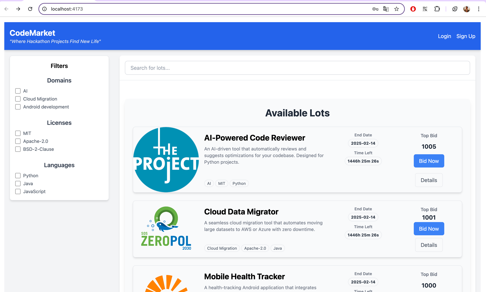

- **Searching lots**  
  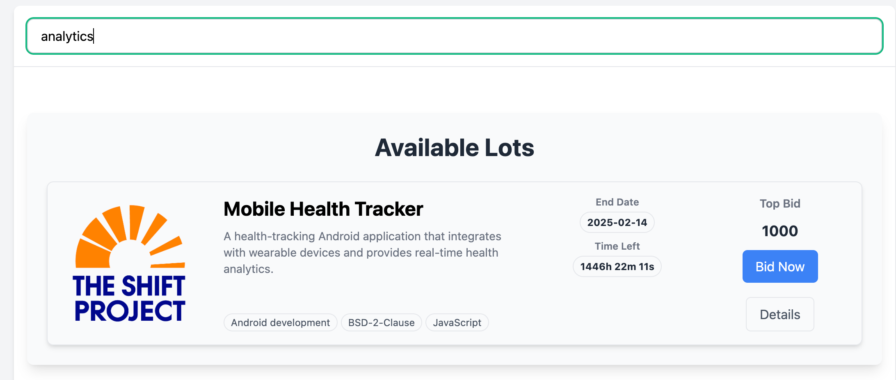

- **Filtering the list of lots**  
  

## T2: Placing a Bid
- **Placing a bid**  
  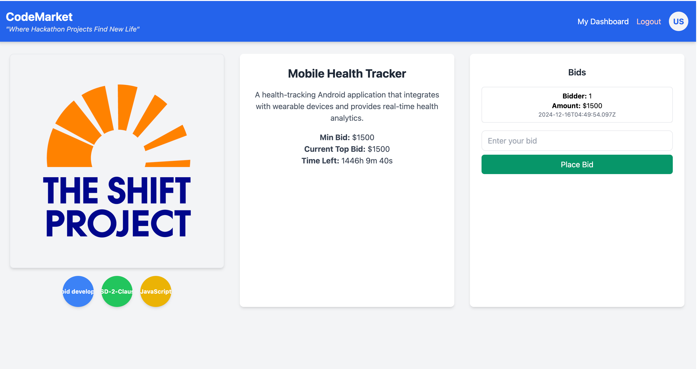

- **Attempting to place a bid as a non-authorized user**  
  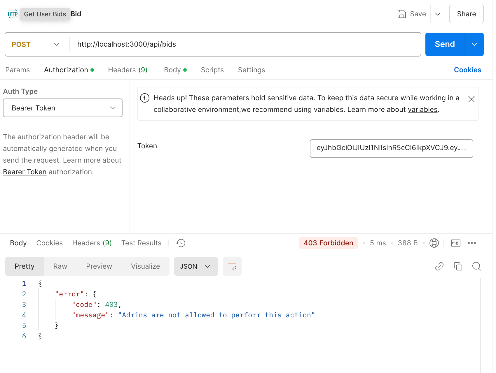

- **Real-time updates (opened in another window)**  
  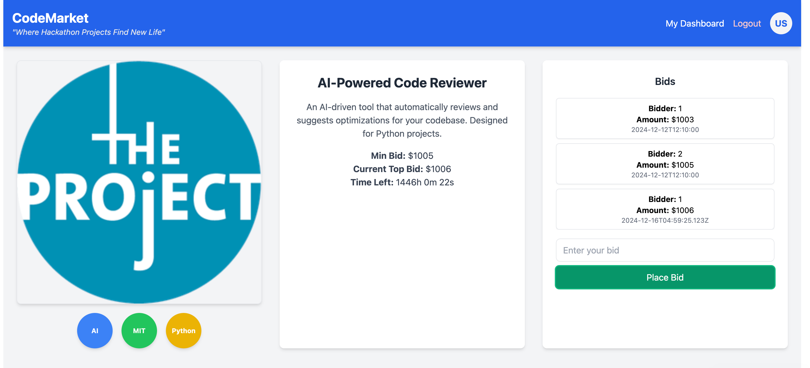

## T3: Client-Side and Server-Side Validation
- **Client-side validation of registration form**  
  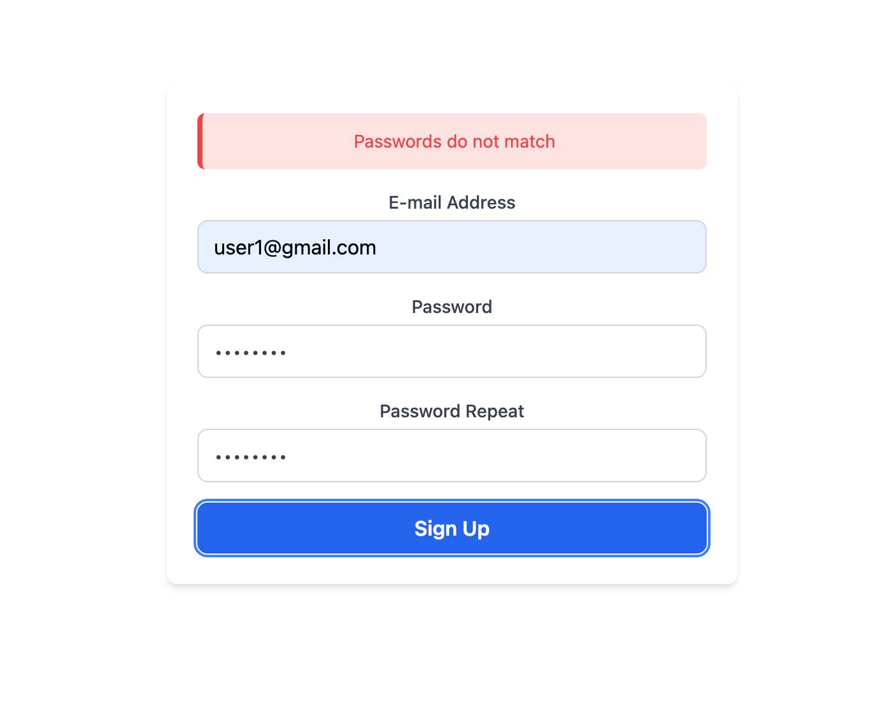

- **Server-side validation with incorrect data (400 response in Postman)**  
  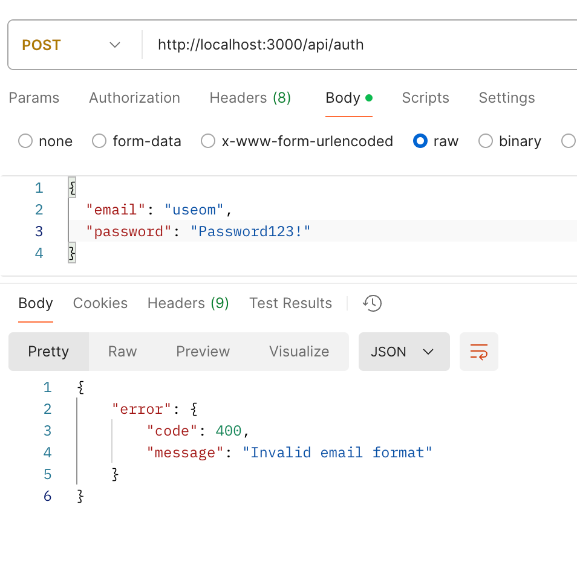

## T4: Admin Management of Lots
- **Creating a lot as an admin**  
  

- **Updating a lot as an admin**  
  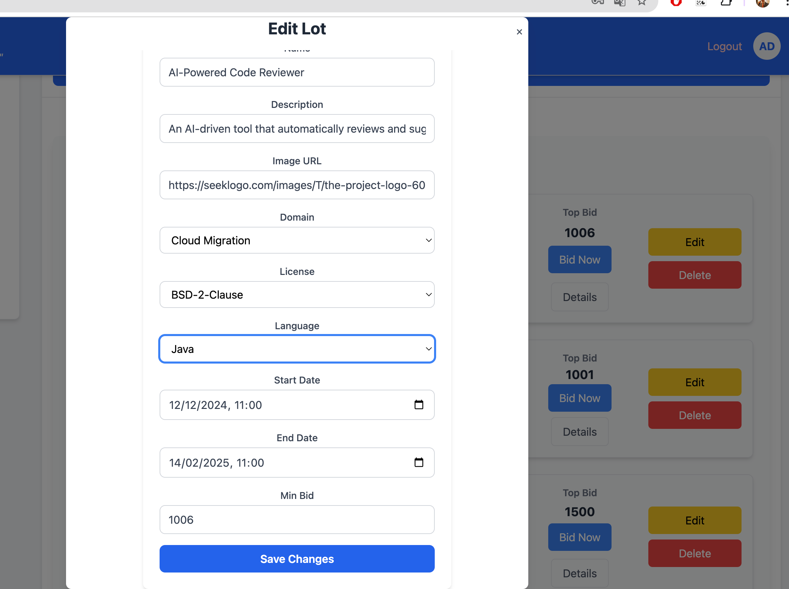

- **Deleting a lot as an admin (200 OK)**  
  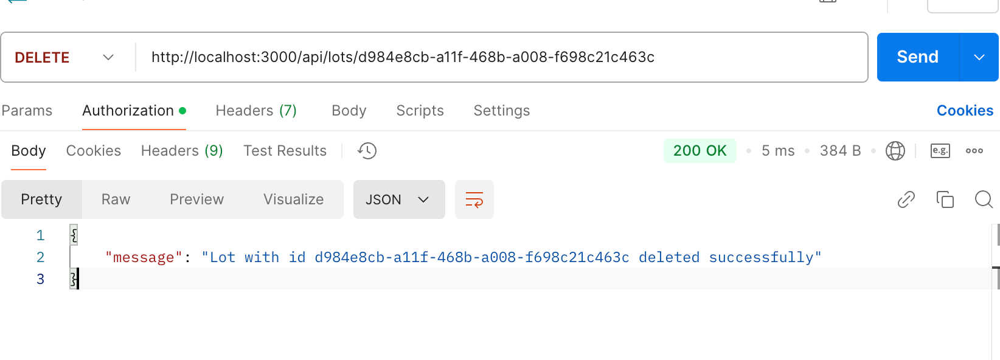

- **Attempting to modify a lot as a non-admin (403 Forbidden)**  
  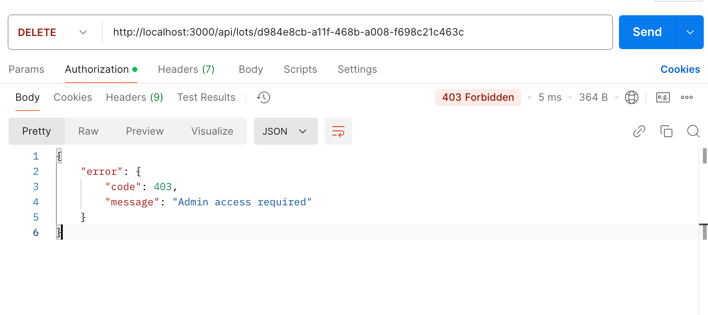

## T5: Viewing Won Auctions
- **Displaying the list of won auctions**  
  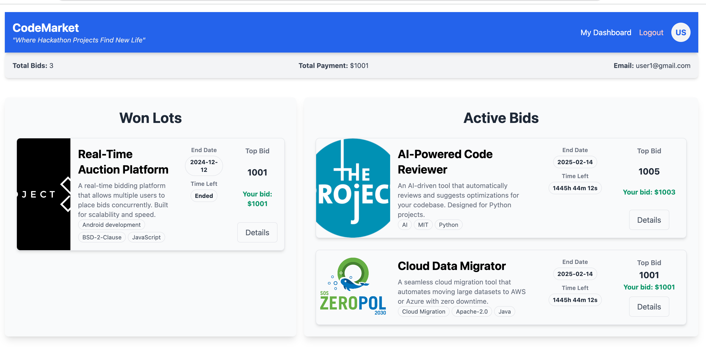

## Test Results

All tests have been successfully passed.

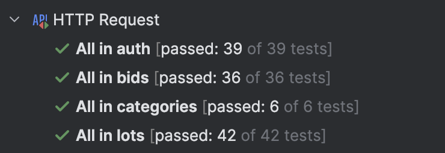